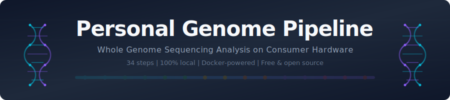
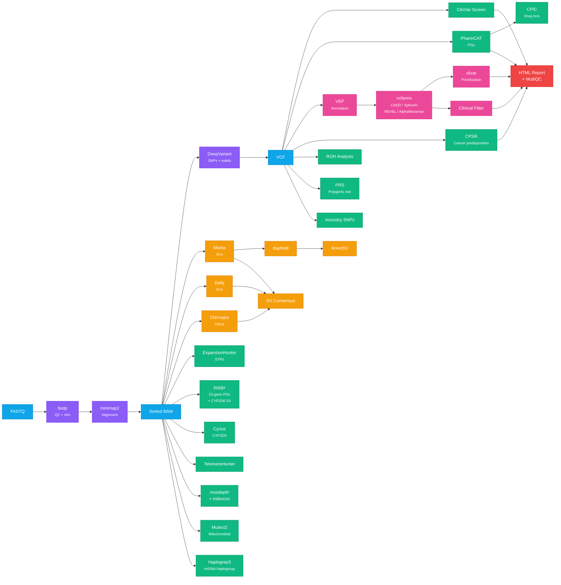

<p align="center">
  
</p>

<h1 align="center">Personal Genome Pipeline</h1>

<p align="center">
  <strong>Analyze your own whole genome sequencing (WGS) data on consumer hardware.</strong><br>
  No cloud accounts, no subscriptions, no bioinformatics degree required.
</p>

<p align="center">
  <a href="LICENSE"></a>
  <a href="https://github.com/GeiserX/Personal-Genome-Pipeline/actions/workflows/lint.yml"></a>
  <a href="https://github.com/GeiserX/Personal-Genome-Pipeline/stargazers"></a>
  <a href="https://www.docker.com/"></a>
  <a href="https://www.nextflow.io/"></a>
  <a href="https://geiserx.github.io/personal-genome-pipeline"></a>
</p>

<p align="center">
  
  
  
  
</p>

This pipeline takes raw sequencing data (FASTQ/BAM/VCF) from any vendor and runs 34 analysis steps to produce a comprehensive genomic profile: variant calling, pharmacogenomics, structural variants, cancer predisposition screening, polygenic risk scores, ancestry estimation, telomere length, mitochondrial analysis, and more. Everything runs locally in Docker containers with resource limits so it won't crash your machine.

**Time:** 6-12 hours per sample on a 16-core desktop | **Disk:** 500 GB minimum per sample | **Cost:** Free (you just need your data)

---

## Who Is This For?

- You got WGS from **Nebula/DNA Complete, Dante Labs, Sequencing.com, Novogene**, or any other vendor and want to analyze it yourself
- You have clinical WGS data (Illumina DRAGEN, BAM+VCF from a hospital) and want deeper analysis than the lab report
- You're a biohacker, researcher, or patient advocate who wants full control over your genomic data
- You can't afford a $500/hour genetics consultant but you have a computer and curiosity

> **Only have 23andMe / MyHeritage / AncestryDNA?** You can still run pharmacogenomics, polygenic risk scores, ClinVar screening, and ROH analysis. See the **[chip data guide](docs/chip-data-guide.md)** for step-by-step conversion instructions and which pipeline steps work with ~600K SNP array data.

---

## What You Get

| Category | What It Finds | Steps |
|---|---|---|
| **Variant Calling** | SNPs, indels, structural variants, copy number variants | 3, 4, 4b, 18, 19 |
| **Clinical Screening** | Pathogenic variants, carrier status, cancer predisposition (CPSR panels) | 6, 17 |
| **Pharmacogenomics** | Drug-gene interactions (23+ genes, CYP2C19, CYP2D6 SV, DPYD, etc.) | 7, 21, 27, 32 |
| **Structural Variants** | Deletions, duplications, inversions, translocations (4 callers + consensus) | 4, 4b, 5, 15, 18, 19, 22 |
| **Functional Annotation** | Impact prediction for every variant (VEP + CADD, SpliceAI, REVEL, AlphaMissense) | 13, 30 |
| **Variant Prioritization** | Rare deleterious variants, compound hets, gene constraint filtering | 31 |
| **Repeat Expansions** | Huntington's, Fragile X, ALS, and 50+ other repeat expansion disorders | 9 |
| **Ancestry & Haplogroups** | Mitochondrial haplogroup, consanguinity check, ancestry SNP intersection | 11, 12, 26 |
| **Telomere Length** | Relative telomere content estimation from WGS reads | 10 |
| **Mitochondrial** | Heteroplasmy detection, mitochondrial disease variants | 12, 20 |
| **Polygenic Risk** | Risk scores for 10 common conditions (CAD, T2D, cancers, etc.) | 25 |
| **Quality Control** | Adapter trimming, coverage statistics, aggregated QC report, sex check, SV filtering | 1b, 15, 16, 16b, 28 |

---

## Pipeline Overview



### All Steps

| # | Step | Tool | Docker Image | Runtime | Required? |
|---|---|---|---|---|---|
| 1 | [ORA to FASTQ](docs/01-ora-to-fastq.md) | orad | `orad` binary | ~30 min | Only for Illumina ORA files |
| 1b | [QC & Trimming](docs/01b-fastp-qc.md) | fastp | `quay.io/biocontainers/fastp:1.3.1` | ~15-30 min | Recommended |
| 2 | [Alignment](docs/02-alignment.md) | minimap2 + samtools | `quay.io/biocontainers/minimap2:2.28` + `staphb/samtools:1.20` | ~1-2 hr | Yes (if starting from FASTQ) |
| 3 | [Variant Calling](docs/03-variant-calling.md) | DeepVariant | `google/deepvariant:1.6.0` | ~2-4 hr | Yes |
| 4 | [Structural Variants](docs/04-structural-variants.md) | Manta | `quay.io/biocontainers/manta:1.6.0` | ~20 min | Recommended |
| 5 | [SV Annotation](docs/05-annotsv.md) | AnnotSV | `getwilds/annotsv:3.4.4` | ~10 min | If step 4 run |
| 6 | [ClinVar Screen](docs/06-clinvar-screen.md) | bcftools isec | `staphb/bcftools:1.21` | ~5 min | Yes |
| 7 | [Pharmacogenomics](docs/07-pharmacogenomics.md) | PharmCAT | `pgkb/pharmcat:3.2.0` | ~10 min | Yes |
| 8 | [HLA Typing](docs/08-hla-typing.md) | T1K | `quay.io/biocontainers/t1k:1.0.9` | ~30 min | Optional |
| 9 | [STR Expansions](docs/09-str-expansions.md) | ExpansionHunter | `quay.io/biocontainers/expansionhunter:5.0.0` | ~15 min | Recommended |
| 10 | [Telomere Length](docs/10-telomere-analysis.md) | TelomereHunter | `lgalarno/telomerehunter:latest` | ~1 hr | Optional |
| 11 | [ROH Analysis](docs/11-roh-analysis.md) | bcftools roh | `staphb/bcftools:1.21` | ~5 min | Recommended |
| 12 | [Mito Haplogroup](docs/12-mito-haplogroup.md) | haplogrep3 | `jtb114/haplogrep3:latest`\* | ~1 min | Optional |
| 13 | [VEP Annotation](docs/13-vep-annotation.md) | VEP | `ensemblorg/ensembl-vep:release_112.0` | ~2-4 hr | Recommended |
| 14 | [Imputation Prep](docs/14-imputation-prep.md) | bcftools | `staphb/bcftools:1.21` | ~10 min | Optional |
| 15 | [SV Quality](docs/15-duphold.md) | duphold | `brentp/duphold:v0.2.3` | ~20 min | If step 4 run |
| 16 | [Coverage QC](docs/16-indexcov.md) | indexcov | `quay.io/biocontainers/goleft:0.2.4` | ~5 sec | Recommended |
| 16b | [Coverage Stats](docs/16b-mosdepth.md) | mosdepth | `quay.io/biocontainers/mosdepth:0.3.13--hba6dcaf_0` | ~10 min | Recommended |
| 17 | [Cancer Predisposition](docs/17-cpsr.md) | CPSR | `sigven/pcgr:2.2.5` | ~30-60 min | Recommended |
| 18 | [CNV Calling](docs/18-cnvnator.md) | CNVnator | `quay.io/biocontainers/cnvnator:0.4.1` | ~2-4 hr | Optional |
| 19 | [SV Calling (Delly)](docs/19-delly.md) | Delly | `quay.io/biocontainers/delly:1.7.3` | ~2-4 hr | Optional |
| 20 | [Mitochondrial](docs/20-mtoolbox.md) | GATK Mutect2 | `broadinstitute/gatk:4.6.1.0` | ~15-30 min | Optional |

#### Post-Processing Steps

These run after the core pipeline completes and combine outputs from earlier steps.

| # | Step | Tool | Docker Image | Runtime | Required? |
|---|---|---|---|---|---|
| 21 | [CYP2D6 Star Alleles](docs/21-cyrius.md) | Cyrius | `python:3.11-slim` | ~10 min | Experimental |
| 22 | [SV Consensus Merge](docs/22-survivor-merge.md) | bcftools | `staphb/bcftools:1.21` | ~5 min | Experimental |
| 23 | [Clinical Filter](docs/23-clinical-filter.md) | bcftools +split-vep | `staphb/bcftools:1.21` | ~5-10 min | If step 13 run |
| 24 | [HTML Report](docs/24-html-report.md) | bash + bcftools | `staphb/bcftools:1.21` | ~1-3 min | Recommended |
| 25 | [Polygenic Risk Scores](docs/25-prs.md) | plink2 | `pgscatalog/plink2:2.00a5.10` | ~30 min | Exploratory |
| 26 | [Ancestry SNPs](docs/26-ancestry.md) | plink2 | `pgscatalog/plink2:2.00a5.10` | ~30-60 min | Experimental |
| 27 | [CPIC Recommendations](docs/27-cpic-lookup.md) | Python + CPIC | `python:3.11-slim` | ~5 min | If step 7 run |
| 28 | [MultiQC Report](docs/28-multiqc.md) | MultiQC | `quay.io/biocontainers/multiqc:1.33` | ~1 min | Recommended |
| 29 | [Somatic Variants](docs/29-mutect2-somatic.md) | GATK Mutect2 | `broadinstitute/gatk:4.6.1.0` | ~2-6 hr | Experimental |
| 30 | [Annotation Enrichment](docs/30-vcfanno.md) | vcfanno | `quay.io/biocontainers/vcfanno:0.3.7` | ~5-15 min | If step 13 run |
| 31 | [Variant Prioritization](docs/31-slivar.md) | slivar | `quay.io/biocontainers/slivar:0.3.3` | ~5-10 min | If step 13 run |
| 32 | [pypgx Pharmacogenomics](docs/32-pypgx.md) | pypgx | `quay.io/biocontainers/pypgx:0.26.0` | ~20-40 min | Recommended |

**Minimum useful run:** Steps 2, 3, 6, 7 (alignment + variant calling + ClinVar + PharmCAT) = ~4-6 hours.
**Full analysis:** All 33 default steps = ~12-20 hours (step 29 somatic calling is opt-in via `SOMATIC=true`). Steps 4/18/19 and 10/12/20 can run in parallel.

#### Alternative Tools (Benchmarking)

No single variant caller is universally best. The pipeline includes alternative tools that output to separate directories so you can compare results without overwriting the defaults.

| Script | Tool | Alternative To | Output Directory |
|---|---|---|---|
| [02a](scripts/02a-alignment-bwamem2.sh) | BWA-MEM2 | minimap2 (step 2) | `aligned_bwamem2/` |
| [03a](scripts/03a-gatk-haplotypecaller.sh) | GATK HaplotypeCaller | DeepVariant (step 3) | `vcf_gatk/` |
| [03b](scripts/03b-freebayes.sh) | FreeBayes | DeepVariant (step 3) | `vcf_freebayes/` |
| [04a](scripts/04a-tiddit.sh) | TIDDIT | Manta (step 4) | `sv_tiddit/` |
| [03c](scripts/03c-strelka2-germline.sh) | Strelka2 | DeepVariant (step 3) | `vcf_strelka2/` |
| [03d](scripts/03d-octopus.sh) | Octopus | DeepVariant (step 3) | `vcf_octopus/` |
| [04b](scripts/04b-gridss.sh) | GRIDSS | Manta (step 4) | `sv_gridss/` |
| [benchmark](scripts/benchmark-variants.sh) | bcftools isec / hap.py | — | `benchmark/` |

See [docs/benchmarking.md](docs/benchmarking.md) for how to run and interpret results, and [docs/tool-rationale.md](docs/tool-rationale.md) for why each default was chosen.

---

## Quick Start

### Step 0: Quick Test (Optional)

Verify everything works on a small public dataset before committing to a full run:

```bash
# See docs/quick-test.md for full instructions
# VCF-only steps finish in under 5 minutes — see docs/quick-test.md for full guide (~30 min including downloads)
```

### Step 0.5: Validate Your Setup

Before running on your own data, verify that all prerequisites are in place:

```bash
export GENOME_DIR=/path/to/your/data
./scripts/validate-setup.sh your_name
```

This checks Docker, disk space, reference data, Docker images, and sample files. Fix any `[FAIL]` items before proceeding.

### Path A: I Have FASTQ Files (Raw Reads)

Most common if you downloaded data from Nebula, Dante Labs, Novogene, BGI, or any sequencing provider.

```bash
# 1. Set your data directory (where your FASTQ files are)
export GENOME_DIR=/path/to/your/data
export SAMPLE=your_name

# 2. Download the GRCh38 reference genome (~3.1 GB)
mkdir -p ${GENOME_DIR}/reference
# Download Homo_sapiens_assembly38.fasta + .fai from GATK resource bundle
# See docs/00-reference-setup.md for details

# 3. Run the pipeline
./scripts/01b-fastp-qc.sh $SAMPLE        # QC + adapter trimming (~15-30 min)
./scripts/02-alignment.sh $SAMPLE        # FASTQ -> sorted BAM (~1-2 hr)
./scripts/03-deepvariant.sh $SAMPLE      # BAM -> VCF (~2-4 hr)
./scripts/06-clinvar-screen.sh $SAMPLE   # Find pathogenic variants (~5 min)
./scripts/07-pharmacogenomics.sh $SAMPLE # Drug-gene interactions (~10 min)

# 4. Optional: structural variants, annotation, etc.
./scripts/04-manta.sh $SAMPLE
./scripts/13-vep-annotation.sh $SAMPLE
./scripts/17-cpsr.sh $SAMPLE
# ... see full step table above
```

### Path B: I Have a BAM File (Aligned Reads)

Common if your lab or vendor already aligned the reads (Illumina DRAGEN output, clinical labs).

```bash
export GENOME_DIR=/path/to/your/data
export SAMPLE=your_name

# Your BAM should be at: ${GENOME_DIR}/${SAMPLE}/aligned/${SAMPLE}_sorted.bam
# Skip step 2 (alignment) and start directly with variant calling:
./scripts/03-deepvariant.sh $SAMPLE
./scripts/06-clinvar-screen.sh $SAMPLE
./scripts/07-pharmacogenomics.sh $SAMPLE
```

### Path C: I Have a VCF File (Variant Calls)

If you already have variants called (from DRAGEN, GATK, or another pipeline).

```bash
export GENOME_DIR=/path/to/your/data
export SAMPLE=your_name

# Your VCF should be at: ${GENOME_DIR}/${SAMPLE}/vcf/${SAMPLE}.vcf.gz
# Skip steps 2-3 and go straight to analysis:
./scripts/06-clinvar-screen.sh $SAMPLE
./scripts/07-pharmacogenomics.sh $SAMPLE
./scripts/13-vep-annotation.sh $SAMPLE
./scripts/17-cpsr.sh $SAMPLE
```

### Path D: I Have Illumina ORA Files

ORA is Illumina's proprietary compressed FASTQ format. Decompress first, then follow Path A.

```bash
./scripts/01-ora-to-fastq.sh $SAMPLE   # ORA -> FASTQ
./scripts/01b-fastp-qc.sh $SAMPLE      # QC + adapter trimming
./scripts/02-alignment.sh $SAMPLE       # FASTQ -> BAM
# ... continue as Path A
```

### Nextflow

A Nextflow DSL2 execution path (v0.5.0) covers post-calling interpretation and clinical analysis — it accepts VCF + BAM from any upstream caller and runs the same pharmacogenomics, annotation, and clinical steps as the bash scripts. Both paths are maintained and produce biologically equivalent results (output file names and report scope may differ).

```bash
# Minimal run — default tools need no external databases
nextflow run main.nf --input samplesheet.csv --reference /path/to/GRCh38.fasta -profile docker

# Enable database-requiring tools (VEP, CPSR, ClinVar, ExpansionHunter)
nextflow run main.nf --input samplesheet.csv --reference /path/to/GRCh38.fasta \
    --tools 'pharmcat,cpic,vcfanno,roh,prs,mito_haplogroup,hla_typing,telomere_hunter,mosdepth,mito_variants,cyrius,html_report,multiqc,vep,slivar,clinical_filter,cpsr,clinvar,expansion_hunter,pypgx,ancestry' \
    --vep_cache /path/to/vep_cache \
    --pcgr_data /path/to/pcgr_data \
    --vep_cache_cpsr /path/to/vep_cache_113 \
    --clinvar /path/to/clinvar.vcf.gz \
    --clinvar_index /path/to/clinvar.vcf.gz.tbi \
    --expansion_catalog /path/to/variant_catalog.json \
    --hla_dat /path/to/hla.dat \
    --slivar_bin /path/to/slivar \
    --pypgx_bundle /path/to/pypgx-bundle \
    --ancestry_ref /path/to/1kg_common_snps.vcf.gz \
    -profile docker
```

See [docs/nextflow.md](docs/nextflow.md) for samplesheet format, tool selection, sarek integration, and bash vs Nextflow comparison.

---

## Prerequisites

### Hardware Requirements

| Resource | Minimum | Recommended | Notes |
|---|---|---|---|
| **CPU** | 4 cores | 16+ cores | DeepVariant scales linearly with cores |
| **RAM** | 16 GB | 32 GB | Some steps need 8-16 GB; pipeline limits each container |
| **Disk** | 500 GB free | 1 TB+ | See [detailed breakdown](docs/hardware-requirements.md) |
| **Internet** | Broadband | 100+ Mbps | ~70-75 GB core downloads + ~104 GB optional annotation databases |
| **OS** | Linux (amd64) | Ubuntu 22.04+ | macOS/ARM works but slower (see below) |

> **Disk space is the #1 surprise.** A single 30X WGS sample produces 60-90 GB of FASTQ, 30-80 GB of BAM, plus reference genomes and databases. See [docs/hardware-requirements.md](docs/hardware-requirements.md) for the full breakdown.

### Software

| Software | Version | Install |
|---|---|---|
| Docker | 20.10+ | [docs.docker.com/get-docker](https://docs.docker.com/get-docker/) |
| bash | 4.0+ | Pre-installed on Linux; macOS ships 3.2 — install via `brew install bash` |
| wget or curl | Any | For downloading references |
| python3 *(optional)* | 3.6+ | Used by long-read alignment (02b) for symlink resolution. Falls back to `readlink -f` on GNU/Linux if absent |

That's it. Every analysis tool runs inside Docker -- no conda environments, no Python version conflicts, no compilation.

### Reference Data (One-Time Downloads)

| Resource | Size | Required For |
|---|---|---|
| GRCh38 reference FASTA + index | ~3.5 GB | All steps |
| ClinVar database | ~200 MB | Step 6 (ClinVar screen) |
| VEP cache | ~26 GB | Step 13 (VEP annotation) |
| PCGR/CPSR data bundle + VEP 113 cache | ~31 GB | Step 17 (cancer predisposition) |
| Docker images (all steps) | ~10-15 GB | All steps |
| Annotation databases (CADD, SpliceAI, REVEL, AlphaMissense) | ~104 GB | Steps 30-31 (optional) |
| **Total one-time setup (core)** | **~70-75 GB** | |
| **Total with annotation enrichment** | **~175 GB** | |

See [docs/00-reference-setup.md](docs/00-reference-setup.md) for download instructions.

---

## Platform Notes

### Linux (Recommended)
Best performance. Docker runs natively. All pipeline images are linux/amd64. No issues.

### macOS (Intel)
Works fine. Docker Desktop runs a Linux VM, so there's a ~10-20% I/O overhead on file operations. Set Docker Desktop memory to at least 16 GB (Preferences > Resources).

### macOS (Apple Silicon / M1-M4)
Works but **slower**. All bioinformatics Docker images are amd64 and run under Rosetta 2 emulation (2-5x performance penalty). DeepVariant and BWA-MEM2 are the most affected. Set Docker Desktop to use Rosetta 2 for amd64 emulation (enabled by default on newer versions).

### Windows (WSL2)
Works. Install Docker Desktop with WSL2 backend. **Critical:** Keep all genomics data on the Linux filesystem (`~/data/`, not `/mnt/c/`). Accessing Windows drives from WSL2 is 10-50x slower due to the 9P protocol. Set WSL2 memory in `%UserProfile%\.wslconfig`:
```ini
[wsl2]
memory=24GB
swap=8GB
```

### Unraid / NAS Servers
Works great for long-running analyses. Use `--cpus` and `--memory` Docker flags (already set in all scripts) to avoid starving other services. Consider running in detached mode (`-d` flag) for multi-hour steps.

---

## Data from Your Vendor

Different vendors deliver data in different formats. Here's what you need to know:

| Vendor | Format You Get | Pipeline Entry Point | Notes |
|---|---|---|---|
| **Nebula / DNA Complete** | FASTQ + VCF | Path A (FASTQ) or Path C (VCF) | Uses BGI/MGI sequencing |
| **Dante Labs** | FASTQ + BAM + VCF | Any path | Standard Illumina |
| **Sequencing.com** | FASTQ + BAM + VCF | Any path | Standard Illumina |
| **Novogene / BGI** | FASTQ | Path A | BGI read names differ from Illumina but work fine |
| **Illumina DRAGEN (clinical)** | ORA or BAM + VCF | Path D (ORA) or Path B/C | ORA needs decompression first |
| **Oxford Nanopore** | POD5/FAST5 + BAM | [Long-read guide](docs/long-read-guide.md) | minimap2 + Clair3 + Sniffles2 |
| **PacBio HiFi** | HiFi BAM | [Long-read guide](docs/long-read-guide.md) | minimap2 + Clair3 + Sniffles2 |
| **23andMe / Ancestry / MyHeritage** | Genotyping array TSV | Partial (VCF steps only) | Not WGS -- convert to VCF first |

See [docs/vendor-guide.md](docs/vendor-guide.md) for detailed conversion instructions for each vendor.

---

## Directory Structure

The pipeline expects this layout (created automatically by the scripts):

```
${GENOME_DIR}/
  reference/
    Homo_sapiens_assembly38.fasta      # GRCh38 reference genome
    Homo_sapiens_assembly38.fasta.fai  # FASTA index
  clinvar/
    clinvar.vcf.gz                     # ClinVar database
    clinvar.vcf.gz.tbi                 # ClinVar index
  vep_cache/                           # VEP annotation cache (~30 GB)
  pcgr_data/                           # CPSR/PCGR data bundle (~5 GB)
  ${SAMPLE}/
    fastq/                             # Raw FASTQ files (R1 + R2)
    fastq_trimmed/                     # QC-trimmed FASTQs + fastp reports (step 1b)
    aligned/
      ${SAMPLE}_sorted.bam             # Aligned reads
      ${SAMPLE}_sorted.bam.bai         # BAM index
    vcf/
      ${SAMPLE}.vcf.gz                 # Variant calls
      ${SAMPLE}.vcf.gz.tbi             # VCF index
      ${SAMPLE}.report.html            # PharmCAT report (step 7)
    manta/                             # Structural variants (step 4)
    annotsv/                           # Annotated SVs (step 5)
    clinvar/                           # ClinVar hits (step 6)
    clinical/                          # Clinically filtered variants (step 23)
    vep/                               # Functional annotation (steps 13, 30)
    slivar/                            # Prioritized variants (step 31)
    pypgx/                             # pypgx PGx star alleles (step 32)
    cpsr/                              # Cancer predisposition (step 17)
    mito/                              # Haplogroup + mitochondrial variants (steps 12, 20)
    ...                                # Other analysis directories
```

---

## Common Issues

| Problem | Cause | Fix |
|---|---|---|
| Container exits silently | Out of memory (OOM killed) | Increase Docker memory or reduce `--memory` flag. Check `docker logs <container>`. |
| "Permission denied" writing output | Container runs as non-root | Add `--user root` to `docker run` (already done in all scripts) |
| VEP cache download fails/times out | 26 GB download over unreliable connection | Use `wget -c` (supports resume). See [docs/13-vep-annotation.md](docs/13-vep-annotation.md) |
| DeepVariant crashes on Mac | amd64 emulation + memory pressure | Reduce `--cpus` to 2 and `--memory` to 8g. Will be slow. |
| Wrong number of variants (too few) | Genome build mismatch | Ensure your BAM is aligned to GRCh38 (hg38), not hg19/GRCh37. Check with `samtools view -H your.bam \| grep SN:chr1` |
| 0-byte output files | Missing input or wrong path | Check that all input files exist. Run the script with `bash -x` for debug output. |
| "No such image" on `docker pull` | Image name/tag changed | Check the exact image name in the step's documentation. Biocontainer tags change frequently. |
| Very slow on macOS | Rosetta 2 emulation overhead | Expected. Consider running on a Linux machine or cloud instance for heavy steps. |

For detailed solutions, see:
- [docs/chip-data-guide.md](docs/chip-data-guide.md) — using 23andMe/MyHeritage/AncestryDNA data with this pipeline
- [docs/troubleshooting.md](docs/troubleshooting.md) — comprehensive troubleshooting guide organized by symptom
- [docs/lessons-learned.md](docs/lessons-learned.md) — every failure encountered during development
- [docs/glossary.md](docs/glossary.md) — alphabetical glossary of genomics terms

---

## FAQ

**Q: How much does WGS cost?**
$200-$1,000 depending on the vendor. Nebula/DNA Complete: $495 for 30X. Dante Labs: ~$300-600. Sequencing.com: $399. Novogene (research): ~$200-400. The pipeline itself is free.

**Q: I only have 23andMe/AncestryDNA data. Can I use this?**
Yes, partially. You can convert chip data to VCF and run pharmacogenomics (step 7), PRS (step 25), ClinVar screening (step 6), and ROH analysis (step 11). You cannot run alignment, variant calling, structural variants, repeat expansions, or ancestry analysis. See the **[chip data guide](docs/chip-data-guide.md)** for conversion instructions, which steps work, and what to expect.

**Q: How long does the full pipeline take?**
On a 16-core/32GB desktop: ~6-12 hours per sample for the core steps. All 33 default steps take ~12-20 hours (step 29 somatic calling is opt-in via `SOMATIC=true`, bringing the total to 34). Many steps can run in parallel (Manta + CNVnator + Delly, or TelomereHunter + Mutect2-mito + haplogrep3).

**Q: Can I run this on a Raspberry Pi?**
No. Most bioinformatics Docker images are amd64 only, and a Pi doesn't have enough RAM. Minimum is a desktop/server with 16 GB RAM and an x86_64 CPU.

**Q: My data is aligned to hg19/GRCh37. What do I?**
Extract FASTQ from your BAM (`samtools fastq`) and re-align to GRCh38 using step 2. LiftOver is an alternative but introduces artifacts. Re-alignment is cleaner.

**Q: I found a pathogenic variant. Should I be worried?**
Probably not. A typical genome shows 0-10 pathogenic/likely pathogenic ClinVar hits, almost all heterozygous (one copy) for recessive conditions. This means you're a **carrier**, not affected. Only worry if: (1) the variant is in a **dominant** gene, (2) you have **two** pathogenic variants in the same recessive gene, or (3) it is in a cancer predisposition gene (BRCA1/2, MLH1, etc.). See [interpreting-results.md](docs/interpreting-results.md) for details.

**Q: What are VUS? Should I worry about them?**
VUS (Variants of Uncertain Significance) mean there is not enough evidence to classify the variant as pathogenic or benign. The majority will eventually be reclassified as benign. They are **not actionable** — do not change your medical care based on a VUS. Check back in 1-2 years with an updated ClinVar database.

**Q: How often should I re-run the analysis?**
ClinVar and other databases are updated monthly. Re-running the ClinVar screen (step 6, ~5 minutes) and CPSR (step 17, ~30 minutes) every 6-12 months with updated databases can catch newly classified variants. The compute-heavy steps (alignment, variant calling) do not need to be re-run unless you get new sequencing data.

**Q: I ran the pipeline on two people (me and my partner). How do I compare?**
See [docs/multi-sample.md](docs/multi-sample.md) for carrier cross-screening, pharmacogenomics comparison, and family analysis.

**Q: Is this clinically validated?**
No. This is a research/educational pipeline. It uses well-known open-source tools (DeepVariant, VEP, ClinVar, PharmCAT) but has not been through clinical validation. The tools themselves are research-grade and their results should not be treated as clinical diagnoses. Always discuss findings with a healthcare provider.

**Q: What about long-read sequencing (Nanopore, PacBio)?**
Supported since v0.3.0. See the [long-read guide](docs/long-read-guide.md) for ONT and PacBio HiFi workflows using minimap2, Clair3, and Sniffles2. Most downstream VCF-based steps work as-is.

**Q: My vendor's download link expired. Can I still get my data?**
It depends on the vendor. Dante Labs deletes data after 30 days. Sequencing.com archives to cold storage (1-3 day retrieval). DNA Complete requires an active subscription. Novogene/BGI keep data for ~90 days. **Always download your raw data immediately.** See [docs/vendor-guide.md](docs/vendor-guide.md) for vendor-specific details.

---

## Why Run Locally?

### Cost Comparison

| Approach | Cost | What You Get | Data Privacy |
|---|---|---|---|
| **This pipeline** | $0 (free, open source) | 33 default + 1 opt-in analysis steps | Your data never leaves your machine |
| Clinical WGS interpretation | $500-5,000 | 1-page report, selected genes only | Lab retains your data |
| Nebula/Dante report | $0-200 (included/add-on) | Web dashboard, limited depth | Data on company servers |
| 23andMe Health | $229 | ~10 health reports from array data | Data shared with research partners |
| Genetic counselor consultation | $200-500/hour | Expert interpretation of specific findings | HIPAA-protected |

**The pipeline is complementary, not a replacement.** Use it for comprehensive self-analysis, then bring specific findings to a genetic counselor or physician for clinical interpretation.

### Privacy and Security

Your genome is the most permanent piece of personal data you have. Unlike a password, you cannot change it if it leaks.

**This pipeline keeps your data local:**
- No data is uploaded to any server, cloud, or API
- No telemetry, no analytics, no tracking
- After completing [reference setup](docs/00-reference-setup.md) (which pre-downloads all databases and Docker images), the core pipeline runs offline
- A few steps fetch small public resources on first use if not already present: step 4b downloads the ENCODE blacklist (~50 KB), step 13 can download the VEP cache (~26 GB) if skipped during setup, and steps 25/26 download scoring files and reference panels from public FTP servers. No sample data is ever uploaded. All downloads are cached after the first run

**Recommendations for securing your data:**
- Store genomic data on an encrypted filesystem (LUKS on Linux, FileVault on macOS, BitLocker on Windows)
- Never upload raw FASTQ/BAM/VCF files to unencrypted cloud storage
- If using a NAS, enable encryption at rest
- Be cautious with VCF files in particular — they are small enough to accidentally email or upload
- Consider who has physical access to the machine where your data is stored
- If you delete your data, use `shred` (Linux) or secure erase — standard file deletion leaves data recoverable

**GDPR note:** If you are in the EU, your genomic data is classified as "special category personal data" under GDPR Article 9. Processing it locally for personal use is lawful. Sharing it with third parties (including cloud services) may require explicit consent and appropriate safeguards.

---

## Disclaimer

This pipeline is for **educational and research purposes only**. It is not a medical device and has not been clinically validated. Genomic findings should always be discussed with a qualified healthcare professional before making any medical decisions. The authors are not responsible for any actions taken based on pipeline output.

Your genome data is sensitive personal information. This pipeline runs entirely locally -- no data is uploaded anywhere. Keep your data secure.

---

## Lessons Learned

See [docs/lessons-learned.md](docs/lessons-learned.md) for every failure encountered during development and how it was resolved. This includes Docker image issues, tool-specific bugs, bcftools quirks, VEP cache problems, and general Docker tips.

---

## Learn More

- [docs/interpreting-results.md](docs/interpreting-results.md) — what your results mean, with examples
- [docs/multi-sample.md](docs/multi-sample.md) — comparing two or more genomes (partners, family)
- [docs/resources.md](docs/resources.md) — free courses, databases, and tools for learning genomics
- [docs/quick-test.md](docs/quick-test.md) — verify your setup with public test data

## Contributing

Found a bug? Have a tool suggestion? See [CONTRIBUTING.md](CONTRIBUTING.md) for guidelines. The pipeline is designed to be extended -- each step is a standalone script with its own documentation.

## License

GPL-3.0 — see [LICENSE](LICENSE)
