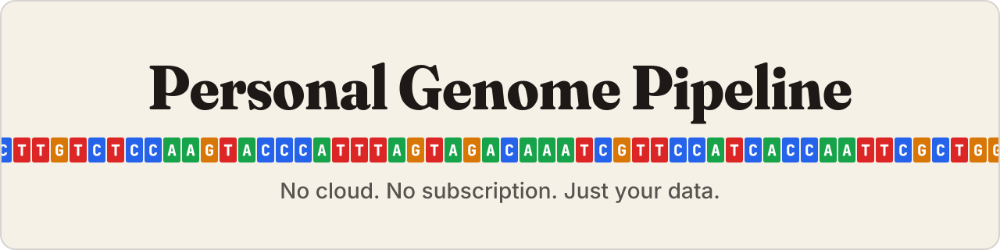

<p align="center">
  
</p>

<h1 align="center">Personal Genome Pipeline</h1>

<p align="center">
  <strong>Analyze your own whole genome sequencing (WGS) data on consumer hardware.</strong><br>
  No cloud accounts, no subscriptions, no bioinformatics degree required.
</p>

<p align="center">
  <a href="https://github.com/GeiserX/Personal-Genome-Pipeline/releases"></a>
  <a href="https://github.com/GeiserX/Personal-Genome-Pipeline/actions/workflows/lint.yml"></a>
  <a href="LICENSE"></a>
  <a href="https://github.com/GeiserX/Personal-Genome-Pipeline/stargazers"></a>
</p>

This pipeline takes raw sequencing data (FASTQ/BAM/VCF) from any vendor and runs 35 analysis steps to produce a full genomic profile: variant calling, pharmacogenomics, structural variants, cancer predisposition screening, polygenic risk scores, ancestry estimation, telomere length, mitochondrial analysis, and more. Everything runs locally in Docker containers with resource limits so it won't crash your machine.

**Time:** 6-12 hours per sample on a 16-core desktop | **Disk:** 500 GB minimum per sample | **Cost:** Free (you just need your data)

## Features

- Takes FASTQ, BAM, VCF or Illumina ORA from any vendor (Nebula, Dante Labs, Sequencing.com, Novogene, DRAGEN), plus long reads from Nanopore and PacBio HiFi.
- Calls SNPs and indels with DeepVariant, and structural and copy number variants with Manta, Delly and CNVpytor merged into a consensus.
- Screens ClinVar and runs CPSR cancer predisposition panels, VEP annotation with CADD, SpliceAI, REVEL and AlphaMissense, and slivar prioritization.
- Pharmacogenomics with PharmCAT, pypgx (23 genes, CYP2D6 SVs), Cyrius and CPIC drug recommendations.
- Repeat expansions, HLA typing, telomere length, mitochondrial haplogroup and heteroplasmy, ROH, ancestry and polygenic risk scores.
- Every tool runs in a pinned Docker container with CPU and memory limits. Nothing is uploaded, and after reference setup the core runs offline.
- Two ways to run it: one bash script per step, or a Nextflow DSL2 pipeline.
- Ends in an HTML report and a MultiQC summary. Alternative callers (GATK, FreeBayes, Strelka2, Octopus, BWA-MEM2, TIDDIT, GRIDSS) are there for benchmarking.

## Quick start

Start from FASTQ (other entry points in [Getting started](docs/getting-started.md)):

```bash
export GENOME_DIR=/path/to/your/data SAMPLE=your_name
./scripts/validate-setup.sh $SAMPLE
./scripts/02-alignment.sh $SAMPLE && ./scripts/03-deepvariant.sh $SAMPLE && ./scripts/06-clinvar-screen.sh $SAMPLE && ./scripts/07-pharmacogenomics.sh $SAMPLE
```

Download the GRCh38 reference and databases first with [reference setup](docs/00-reference-setup.md). Try a small public dataset with the [quick test](docs/quick-test.md).

## Documentation

- [Documentation index](docs/index.md): every page, including one page per pipeline step
- [Getting started](docs/getting-started.md): who it is for, prerequisites and platform notes (macOS, WSL2, Unraid), the FASTQ, BAM, VCF and ORA paths, Nextflow, vendor formats, directory layout
- [Pipeline overview](docs/pipeline-overview.md): what you get, the pipeline graph, every step with its image and runtime
- [Interpreting results](docs/interpreting-results.md) and [multi-sample analysis](docs/multi-sample.md)
- [Common issues and FAQ](docs/faq.md), [troubleshooting](docs/troubleshooting.md), [lessons learned](docs/lessons-learned.md), [glossary](docs/glossary.md)
- [Why run locally?](docs/why-local.md): cost comparison, privacy and security
- [Nextflow](docs/nextflow.md), [long-read guide](docs/long-read-guide.md), [chip data guide](docs/chip-data-guide.md), [resources](docs/resources.md)
- [Contributing](CONTRIBUTING.md): each step is a standalone script with its own documentation

## Disclaimer

This pipeline is for **educational and research purposes only**. It is not a medical device and has not been clinically validated. Genomic findings should always be discussed with a qualified healthcare professional before making any medical decisions. The authors are not responsible for any actions taken based on pipeline output.

Your genome data is sensitive personal information. This pipeline runs entirely locally -- no data is uploaded anywhere. Keep your data secure.

## License

[GPL-3.0-or-later](LICENSE)
