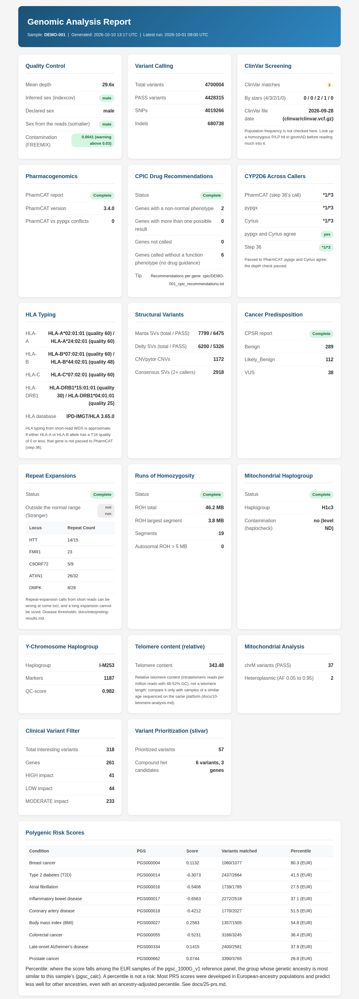

# Step 24: HTML Report

## What This Does

Generates a self-contained HTML dashboard summarizing all pipeline results. Open it in any browser — no internet connection needed.

## Why

The pipeline produces output across many directories in different formats (VCF, TSV, HTML, TXT). This step consolidates everything into a single visual report with color-coded status indicators, variant counts, and key findings.

## Tool

`bin/collect_summary.py` reads every step's output once into `${SAMPLE}/summary.json`, and `bin/render_report.py` renders the report from it. `scripts/generate-report.sh` renders the text report from the same summary, so the two reports cannot disagree about a count. Both are Python standard library only.

## Docker Image

- `PYTHON_IMAGE`

Pinned in `versions.env`; [Image versions](versions.md) lists the current tag.

## Input

All output directories from previous pipeline steps. The script detects which steps have been run. It reads the bash layout (`${GENOME_DIR}/${SAMPLE}`) and the Nextflow one (`--outdir/${SAMPLE}`, for example `roh/`, `coverage/`, `hla/`, `pharmcat/`), so `GENOME_DIR=<outdir> ./scripts/24-html-report.sh <sample>` reports on a Nextflow run.

Two more files, when present:
- `${SAMPLE}/run_manifest.tsv` (`bin/write_manifest.sh`): the pipeline commit, `versions.env`, the digest of every image, the ClinVar file date, the VEP cache, the PCGR and pypgx bundles, the HLA database release and the header of each PGS scoring file. `run-all.sh` writes it when a run starts and again just before this step, so an image pulled during the run gets its digest; this step writes one when the sample has none.
- `${SAMPLE}/logs/run_status.tsv`: when the latest `run-all.sh` run started, each step it skipped and why, and, once the pipeline has finished, `ok` for each step it ran and the result of each script it ran after the pipeline.

## Command

```bash
./scripts/24-html-report.sh your_name
```

## Output

`${GENOME_DIR}/${SAMPLE}/${SAMPLE}_report.html` and `${GENOME_DIR}/${SAMPLE}/summary.json`.

The report contains:
- **Quality Control** — mean depth (mosdepth), sex inferred from X/Y coverage (indexcov) against the declared sex, and from step 33: the sex somalier infers from the reads, FREEMIX (VerifyBamID2's estimate of reads from another person) against its warning threshold, and any other sample that is the same person
- **Variant Calling** — total variants, PASS count, SNPs, indels (one pass over the VCF)
- **ClinVar Screening** — hit count by review stars, the ClinVar file date, and the hits table best-reviewed first with a Stars column
- **Pharmacogenomics** — PharmCAT version and PharmCAT/pypgx conflicts
- **CPIC Drug Recommendations** — genes with a non-normal phenotype, with more than one possible result, not called, and a table of the non-normal genes
- **CYP2D6 Across Callers** — PharmCAT, pypgx and Cyrius side by side, with whether they agree
- **HLA Typing** — T1K alleles per locus and the IPD-IMGT/HLA release
- **Polygenic Risk Scores** — each score with its percentile among the most similar reference group, or "raw score only" without the ancestry panel
- **Structural Variants** — Manta, Delly, CNVpytor and the SURVIVOR consensus (2+ callers) counts
- **Cancer Predisposition** — CPSR status and the classification breakdown (read by column name from `${SAMPLE}.cpsr.grch38.classification.tsv.gz`)
- **Repeat Expansions** — key loci repeat counts (HTT, FMR1, C9orf72, ATXN1, DMPK)
- **Runs of Homozygosity** — total, largest segment, segments, autosomal runs over 5 MB
- **Mitochondrial Haplogroup** — haplogrep3's call, and haplocheck's contamination status ("not checked" when step 12 read the step 03 VCF instead of step 20's calls)
- **Y-Chromosome Haplogroup** — Yleaf's call, its marker count and QC-score, or "insufficient markers" (step 37, when it ran)
- **Telomere Length** — TelomereHunter's telomere content
- **Mitochondrial** — chrM PASS variants and heteroplasmic calls (allele fraction 0.05 to 0.95; below 5% NUMT reads and noise dominate)
- **Clinical Filter** and **slivar** — variant counts from steps 23 and 31
- **Secondary-Findings Genes (ACMG SF v3.3)** — the step 06 ClinVar hits and the clinical filter's rare HIGH-impact records in the 84 genes of the ACMG list, as a list to review with a clinician: the list's per-gene reporting rules (for example HFE homozygous C282Y only) are not applied
- **Steps Not Run** and **Not Assessed by This Pipeline**
- The run manifest in the footer

## Results from an earlier run

A step that is skipped or fails leaves the previous run's output on disk. When `logs/run_status.tsv` exists, a section whose file is older than the latest `run-all.sh` run, and whose step was not `ok` in that run, is marked **STALE** with the file's date and the step's result, in both reports. The pipeline's steps are recorded `ok` only once the whole pipeline has finished: after a failed run every section from before it is marked stale until the same command, with `-resume`, completes. A step you re-ran by hand after that run writes a newer file and is shown as current.

<figure markdown="span">
  { loading=lazy }
  <figcaption>The report for DEMO-001, an invented sample. Every number is made up. The picture stops at the last card, before the ClinVar hits table and the disclaimer.</figcaption>
</figure>

## Runtime

About a minute; reading a whole-genome VCF takes most of it.

## How to Open

```bash
# macOS
open ${GENOME_DIR}/${SAMPLE}/${SAMPLE}_report.html

# Linux
xdg-open ${GENOME_DIR}/${SAMPLE}/${SAMPLE}_report.html

# Windows (WSL)
start ${GENOME_DIR}/${SAMPLE}/${SAMPLE}_report.html
```

## Notes

- The report is completely self-contained — all CSS is inline, no external dependencies
- Works offline in any modern browser
- Responsive layout (works on mobile/tablet)
- Steps that were not run show "Not run" and are listed under Steps Not Run — this is expected
- The report contains health findings: the ClinVar table lists your pathogenic and likely pathogenic variants, and other sections summarise pharmacogenomics, CPSR and the other steps. It holds no raw reads or full VCF, but share it only as you would share a medical record
- Re-run this script anytime to update the report after running additional steps
- The Nextflow `HTML_REPORT` module runs the same `bin/render_report.py` on the outputs of its run's QC, ClinVar, PharmCAT, CPIC, CPSR, clinical filter, slivar, ROH and mitochondrial haplogroup steps, so both reports print the same numbers for the same file. Its clinical filter and slivar cards show counts only. For every section on a Nextflow run, run this script with `GENOME_DIR` set to the `--outdir`
