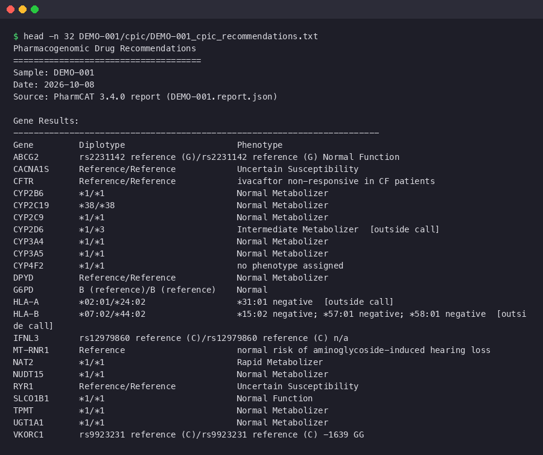

# Step 27: CPIC Drug-Gene Recommendation Lookup

## What This Does

Reads your PharmCAT report (step 7) and writes a plain-text list of the medications whose prescribing guidance depends on your result: for every gene where you are not a normal metabolizer, the drugs PharmCAT's own report matched to your phenotype, with the CPIC recommendation text. With pypgx output (step 32) it also compares the two callers and warns about a gene PharmCAT could not call while pypgx did. With the consensus table of [step 36](36-pgx-consensus.md) it lists the calls other tools gave PharmCAT (HLA-A and HLA-B from T1K, a CYP2D6 call pypgx and Cyrius agree on) and why a gene was held back.

## Why

PharmCAT produces detailed JSON and HTML reports, but finding the actionable parts takes time. This step distills them into one short file. The drug list comes from the PharmCAT report itself (its `drugs` section, maintained by PharmCAT with each data release), so a gene PharmCAT calls is never dropped because a table in this pipeline was missing it.

## Tool

- `bin/pgx_parse.py`, the one PharmCAT reader of the pipeline (Python standard library only). The Nextflow `CPIC_LOOKUP` module and the unit test `tests/test_cpic_parser.py` run the same file.

## Docker Image

- `PYTHON_IMAGE`

Pinned in `versions.env`; [Image versions](versions.md) lists the current tag.

## Input

- PharmCAT JSON report from step 7: the first `*.report.json` (or `*_pharmcat.json`) in `${GENOME_DIR}/${SAMPLE}/pharmcat/`, else in `${GENOME_DIR}/${SAMPLE}/vcf/`.
- Optional: `${GENOME_DIR}/${SAMPLE}/pypgx/${SAMPLE}_pypgx_summary.tsv` from step 32.
- Optional: `${GENOME_DIR}/${SAMPLE}/pgx_consensus/${SAMPLE}_pgx_consensus.tsv` from step 36.

## Command

```bash
./scripts/27-cpic-lookup.sh your_name
```

## What the Script Does Internally

1. Locates the PharmCAT JSON report.
2. Runs `bin/pgx_parse.py cpic-report` in the Python image. It reads the gene calls (PharmCAT 3.x flat `genes` map, the 2.x map nested by source, and the older list are all read) and writes the phenotype table.
3. A gene counts as non-normal only when its phenotype names a changed metabolism or function (poor, intermediate, rapid or ultrarapid metabolizer; decreased, increased, poor or no function), a positive HLA test, a G6PD deficiency, malignant hyperthermia susceptibility, an increased MT-RNR1 risk or an ivacaftor-responsive CFTR. A called gene whose phenotype is anything else (`n/a`, `no phenotype assigned`, a genotype such as VKORC1 `-1639 GG`, `Uncertain Susceptibility`, `Indeterminate`) is `unclassified`: it is listed in the section "Called Genes Without a Function Phenotype", is not counted, and gets no drug list. PharmCAT's own example report has 3 non-normal genes and 7 unclassified ones. For each gene with a non-normal phenotype it lists the drugs from the report's `drugs` section: CPIC's recommendation for the called diplotype per drug first, then the drugs DPWG or the FDA name. PharmCAT lists an annotation for every diplotype the sample may have, so only the ones for the called diplotype (or, without diplotype labels, its phenotype) are shown. When the report names no drug for the gene, it falls back to the gene's `relatedDrugs`, then to a small static table, and finally prints a line saying the gene is not in the drug table, so a gene is never skipped silently.
4. When PharmCAT lists more than one possible diplotype for a gene and their phenotypes differ (positions missing from the VCF leave it unable to choose), the gene is `ambiguous`: it is listed in its own section with the possible phenotypes and no drug guidance, never as its first diplotype.
5. With the pypgx summary it writes the comparison table and, for a gene PharmCAT reports as not called or ambiguous but pypgx called (CYP2D6 is the usual one), a warning in the recommendations naming every drug PharmCAT links to that gene. When pypgx's call is normal the line is a note instead.
6. With step 36's consensus table it writes a section "Calls From Other Tools": each gene passed to PharmCAT as an outside call, from which tool, and whether PharmCAT's report shows it as one (`callSource` `OUTSIDE`); and each gene held back, with the reason and what each caller said. For a held-back CYP2D6 it names the drugs CYP2D6 affects and says no guidance is given for them, and the pypgx-only warning of point 5 is not printed for it: one caller's call is what the consensus refused. Genes PharmCAT reports as outside calls carry `[outside call]` in the gene results. An outside call in PharmCAT's report that the table does not pass on, with the same diplotype, comes from an earlier step 36 run that step 07 has not replaced: it gets no drug guidance, is listed as not called, and a warning says to rerun step 07. When the table is missing (a caller step ran again since) but PharmCAT's report has outside calls, the step passes the missing table, so none of them is confirmed.
7. A report that cannot be read, or that yields no gene, writes a "PARSING FAILED" report and the step exits 1. It never writes an all-clear report from a format it could not read.

The comparison used to be written by step 32. It moved here because `run-all.sh` starts steps 7 and 32 side by side, so step 32 could read a missing or previous-run PharmCAT report; step 27 runs after both.

## Output

| File | Contents |
|---|---|
| `cpic/${SAMPLE}_cpic_recommendations.txt` | Gene results, the medications for each non-normal gene, the called genes without a function phenotype, the calls from other tools (step 36), uncallable genes, and the pypgx warnings |
| `cpic/${SAMPLE}_phenotypes.tsv` | One row per gene: `Gene`, `Diplotype`, `Phenotype`, `Status` (`normal`, `non-normal`, `unclassified`, `ambiguous` or `not called`) |
| `pypgx/${SAMPLE}_pharmcat_comparison.tsv` | PharmCAT and pypgx diplotypes side by side (only when step 32 ran) |

<figure markdown="span">
  { loading=lazy }
  <figcaption>The top of the report for DEMO-001, an invented sample. The diplotypes and phenotypes are made up and are not anyone's result. HLA-A, HLA-B and CYP2D6 are marked as outside calls: step 36 passed them to PharmCAT from the BAM-based callers. Below this table the report lists the medications for each gene that is not normal, the outside calls and the genes that could not be called.</figcaption>
</figure>

## Runtime

About a minute, mostly container start-up.

## Interpreting Results

### Gene Results Table

Lists every pharmacogene with its called diplotype and phenotype (placeholders, not a result):

```
Gene         Diplotype                      Phenotype
CYP2C19      *x/*y                          <phenotype>
CYP2D6       *x/*y                          <phenotype>
```

### Affected Medications

Only genes where your phenotype is not normal appear here, each with the drugs and the CPIC recommendation PharmCAT matched to your result. A phenotype PharmCAT leaves unassigned (`n/a`, `no phenotype assigned`) is listed too: the drug guidance for such genes depends on the diplotype, and the report shows it. Genes that could not be called are listed separately at the end. Their absence from the medications section does NOT mean normal function.

### Calls From Other Tools

When step 36 ran, this section lists HLA-A, HLA-B and CYP2D6: passed to PharmCAT (then their drug guidance is in the sections above, as for any gene PharmCAT called) or not, and why. `indeterminate` for CYP2D6 means the callers did not agree, only one ran, or the depth at CYP2D6 could not be trusted: no drug guidance is given for CYP2D6 then, and the drugs it affects are listed so you know what is not covered.

### PharmCAT and pypgx

When step 32 ran, this section names each gene PharmCAT could not call but pypgx did, with pypgx's call and the drugs it affects. Read those drugs with the pypgx call and [docs/32-pypgx.md](32-pypgx.md).

### What to do with the results

1. Check whether you take (or might be prescribed) any of the listed medications.
2. For any match, read the full CPIC guideline at [cpicpgx.org/guidelines](https://cpicpgx.org/guidelines/).
3. Share the report with your prescribing physician or pharmacist.

## Limitations

- The drug guidance is the one bundled with the pinned PharmCAT release; newer CPIC guidelines arrive with a PharmCAT update.
- The static fallback table is used only when the report names no drug for a gene.
- CYP2D6 has drug guidance here only when pypgx (step 32) and Cyrius (step 21, opt-in) agree and the depth check passed (step 36). Without Cyrius it is always held back.
- This is NOT medical advice. Always consult a healthcare professional before making medication changes.

## Links

- [CPIC Guidelines](https://cpicpgx.org/guidelines/)
- [PharmCAT](https://pharmcat.org/)
- [PharmGKB](https://www.pharmgkb.org/)
- [CPIC Gene-Drug Pairs Table](https://cpicpgx.org/genes-drugs/)
