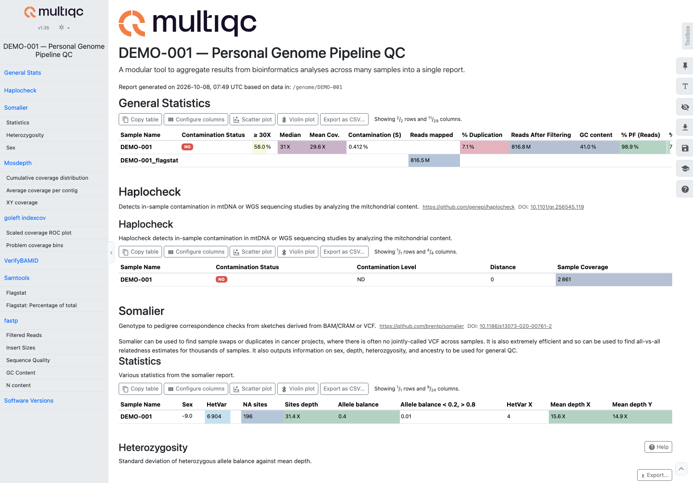

# Step 28: MultiQC Aggregated QC Report

Scans the sample directory for QC outputs from all pipeline steps and combines them into a single interactive HTML dashboard.

---

## What It Does

MultiQC auto-discovers output files from supported bioinformatics tools and renders them into a unified report with:
- **Summary statistics table** — key metrics from each tool in one view
- **Interactive plots** — quality distributions, coverage curves, adapter content
- **Before/after comparisons** — fastp filtering impact

## Why

Without MultiQC, you need to open separate reports from each tool (fastp HTML, mosdepth summary, samtools flagstat). MultiQC combines everything into one page, making it easy to spot problems at a glance.

## Tool

**MultiQC** v1.35 — aggregate bioinformatics QC reports.

- Paper: Ewels et al., Bioinformatics 2016 (doi:10.1093/bioinformatics/btw354)
- Source: [github.com/MultiQC/MultiQC](https://github.com/MultiQC/MultiQC)

## Docker Image

- `MULTIQC_IMAGE`

Pinned in `versions.env`; [Image versions](versions.md) lists the current tag.

## Command

```bash
export GENOME_DIR=/path/to/data
./scripts/28-multiqc.sh <sample_name>
```

## Discovered Tools

MultiQC scans the entire sample directory and auto-detects outputs from these pipeline tools:

| Tool | File Pattern | Pipeline Step |
|---|---|---|
| fastp | `*_fastp.json` | Step 1b (QC + trimming) |
| samtools flagstat | `*_flagstat.txt` | Generated automatically |
| mosdepth | `*.mosdepth.summary.txt`, `*.mosdepth.global.dist.txt` | Step 16b |

The script generates `samtools flagstat` output automatically if a BAM exists but no flagstat file is present.

In the Nextflow pipeline, `multiqc` reads the mosdepth summaries only. A run with no BAM, or without `mosdepth` in `--tools`, has none, so MultiQC is skipped and the log says so in one line (`multiqc skipped: ...`).

## Output

| File | Location | Description |
|---|---|---|
| HTML report | `multiqc/multiqc_report.html` | Interactive QC dashboard (open in browser) |

<figure markdown="span">
  { loading=lazy }
  <figcaption>The top of the MultiQC report for DEMO-001, an invented sample. The read counts and the coverage are made up. The samtools numbers sit in a second row, DEMO-001_flagstat, because MultiQC names that sample after the file.</figcaption>
</figure>

## Runtime

< 1 minute. MultiQC only parses summary files, not raw data.

## Notes

- MultiQC runs after all other steps to capture the most outputs. Through `run-all.sh` it is the pipeline's `MULTIQC` task: it reads the mosdepth summaries (above) and writes `${GENOME_DIR}/multiqc/multiqc_report.html`, beside the sample folders rather than inside one. Run `./scripts/28-multiqc.sh <sample_name>` for the script's report of every QC file in the sample folder
- The report title includes the sample name for easy identification
- If you add new tools to the pipeline that MultiQC supports, their outputs are picked up automatically on the next run
- To re-generate the report (e.g., after running additional steps), delete the `multiqc/` directory and re-run
