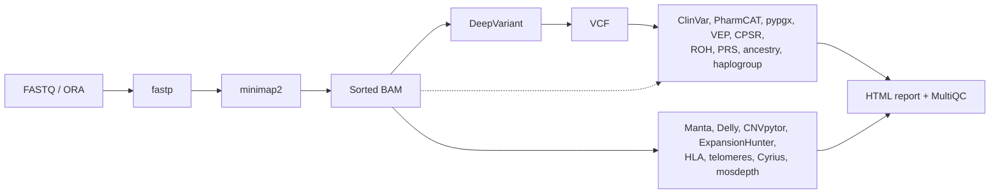

---
hide:
  - navigation
---

# Personal Genome Pipeline { .pgp-visually-hidden }

  

  
  
  
  

---

**Personal Genome Pipeline** turns the files a consumer sequencing vendor gives you (FASTQ, BAM, VCF or Illumina ORA) into a full genomic profile on your own computer: small and structural variants, ClinVar and cancer-predisposition screening, pharmacogenomics, repeat expansions, HLA type, telomere content, mitochondrial haplogroup and heteroplasmy, runs of homozygosity, ancestry and polygenic risk scores. A vendor's own report covers a fraction of this and keeps your genome on their servers; a clinical lab charges per panel. Here every step is one Docker container with a hard memory limit, run by a Nextflow pipeline (`scripts/run-all.sh` starts it for one sample) or from one bash script per step, and no script sends your data anywhere. Start with [Getting started](getting-started.md), then run the [quick test](quick-test.md) on public data before your own.

-   :material-download-outline: **[Getting started](getting-started.md)**

    ---

    Prerequisites, the four entry paths (FASTQ, BAM, VCF, ORA), the first run and what "it worked" looks like.

-   :material-test-tube: **[Quick test](quick-test.md)**

    ---

    Run the pipeline on a small public sample first, so a setup problem shows up in minutes, not a day into the run.

-   :material-graph-outline: **[Pipeline overview](pipeline-overview.md)**

    ---

    Every step with its tool, its image and whether it is required, which steps a default run includes, plus the pipeline graph.

-   :material-file-document-check-outline: **[Interpreting your results](interpreting-results.md)**

    ---

    What each report means, what is normal, what needs a genetic counsellor, and what to re-run when databases update.

## What it finds

- **Small variants:** SNPs and indels with DeepVariant; structural and copy-number variants with Manta, Delly and CNVpytor merged into one consensus set.
- **Clinical screening:** known pathogenic variants from ClinVar, cancer predisposition panels with CPSR, VEP annotation with CADD, SpliceAI, REVEL and AlphaMissense, and slivar prioritisation of rare deleterious variants.
- **Pharmacogenomics:** PharmCAT and pypgx star alleles across 23 genes, CYP2D6 structural alleles with Cyrius, CPIC dosing recommendations.
- **Ancestry and lineage:** mitochondrial haplogroup and heteroplasmy, runs of homozygosity, ancestry placement against the 1000 Genomes panel (optional download), polygenic risk scores for nine conditions.
- **Everything else the reads hold:** HLA type, repeat expansions at the 31 loci of ExpansionHunter's catalog (Huntington's, Fragile X, ALS among them), telomere content, sex-chromosome check, coverage statistics, one HTML report and a MultiQC summary.

<figure markdown="span">
  { loading=lazy }
  <figcaption markdown>The HTML report from [step 24](24-html-report.md), run on DEMO-001, an invented sample. Every number in it is made up.</figcaption>
</figure>

## Pipeline steps

One page per step, grouped by stage. The step number is the script name and the output directory.

- **Reads and small variants:** [1 ORA to FASTQ](01-ora-to-fastq.md), [1b fastp QC and trimming](01b-fastp-qc.md), [2 alignment](02-alignment.md), [3 DeepVariant](03-variant-calling.md), [3d Octopus (alternative)](03d-octopus.md).
- **Structural and copy number variants:** [4 Manta](04-structural-variants.md), [4b GRIDSS (alternative)](04b-gridss.md), [5 AnnotSV](05-annotsv.md), [15 duphold](15-duphold.md), [18 CNVpytor](18-cnvpytor.md), [19 Delly](19-delly.md), [22 consensus merge](22-survivor-merge.md).
- **Clinical screening and annotation:** [6 ClinVar screen](06-clinvar-screen.md), [13 VEP](13-vep-annotation.md), [17 CPSR](17-cpsr.md), [23 clinical filter](23-clinical-filter.md), [29 somatic Mutect2 (opt-in)](29-mutect2-somatic.md), [30 vcfanno](30-vcfanno.md), [31 slivar](31-slivar.md).
- **Pharmacogenomics:** [7 PharmCAT](07-pharmacogenomics.md), [21 Cyrius](21-cyrius.md), [27 CPIC lookup](27-cpic-lookup.md), [32 pypgx](32-pypgx.md).
- **HLA, repeats and telomeres:** [8 HLA typing](08-hla-typing.md), [9 ExpansionHunter](09-str-expansions.md), [9b Stranger](09b-stranger.md), [10 TelomereHunter](10-telomere-analysis.md).
- **Ancestry, risk and mitochondria:** [11 ROH](11-roh-analysis.md), [12 mitochondrial haplogroup](12-mito-haplogroup.md), [14 imputation prep](14-imputation-prep.md), [20 mitochondrial variants](20-mtoolbox.md), [25 polygenic risk scores](25-prs.md), [26 ancestry](26-ancestry.md).
- **Quality control and reports:** [16 indexcov](16-indexcov.md), [16b mosdepth](16b-mosdepth.md), [24 HTML report](24-html-report.md), [28 MultiQC](28-multiqc.md).

Alternative callers for benchmarking (BWA-MEM2, GATK HaplotypeCaller, FreeBayes, Strelka2, TIDDIT) are scripts without a page of their own; [Variant caller benchmarking](benchmarking.md) covers how to run and compare them.

## How it runs

- Each step is one `docker run` with an image tag or digest from `versions.env` (listed on [Image versions](versions.md)) and a hard memory limit. CPU is a hard `--cpus` cap in the single-step scripts; in the pipeline it is a Docker share, so an idle machine lends a step every core and a busy one shares them by weight ([a shared host](hardware-requirements.md#a-shared-host)).
- Two ways to run it: `./scripts/run-all.sh <sample> <male|female>` starts the [Nextflow](nextflow.md) pipeline, which runs independent steps in parallel and resumes after a failure ([Full run](getting-started.md#full-run)); or one bash script per step under `scripts/`, with Docker alone.
- DeepVariant is most of a run: about 13.5 hours on 8 CPUs in one observed ~30x run. Plan for more than a day per sample from a BAM on 8 CPUs, and longer from FASTQ. [Hardware and storage requirements](hardware-requirements.md#runtime-per-step) gives the per-step time, memory and disk figures; a 30X sample needs about 500 GB from a BAM and about 700 GB from FASTQ.
- After [reference data setup](00-reference-setup.md) a run downloads only a few public files, listed in [Why run locally?](why-local.md#network-calls-during-a-run). A BAM or VCF from your vendor skips alignment or variant calling; [Getting started](getting-started.md) has the entry paths and [Vendor compatibility](vendor-guide.md) the per-vendor notes.

## What it does not do

- It is not a medical device and has not been clinically validated. Findings go to a genetic counsellor or physician before any decision; the pipeline uses the same tools a clinical lab uses, but without a lab's validation and confirmation.
- It gives no admixture percentages. PRS percentiles and the closest reference population need the optional 1000 Genomes panel (`setup.sh --ancestry-panel`, about 7 GB); without it step 25 reports raw scores only. A percentile is not a risk. [Step 25](25-prs.md) and [step 26](26-ancestry.md) say what the numbers can and cannot support.
- It does not call CYP2D6 reliably from a VCF alone; that gene needs the BAM-based callers ([Cyrius](21-cyrius.md), [pypgx](32-pypgx.md)), and short-read WGS still misses some alleles.
- It does not impute. [Step 14](14-imputation-prep.md) prepares files for an external imputation server; sending them there is your decision.

## Privacy

- Your reads, alignments and variants stay in `GENOME_DIR` on your disk. No script uploads data. A run still pulls images and fetches a few public files; [Why run locally?](why-local.md#network-calls-during-a-run) lists each one and what the HTML reports load when you open them.
- The example outputs on these pages are invented or use placeholders. No page shows a real person's genotype, haplogroup, HLA type, score or sample name.
- [Why run locally?](why-local.md) compares the cost and the exposure of the alternatives.

## Guides and reference

- [Interpreting your results](interpreting-results.md): what each report means and what to do with it.
- [Multi-sample comparison](multi-sample.md): partners, siblings, parents; carrier overlap and shared variants.
- [Long-read sequencing](long-read-guide.md): Nanopore and PacBio HiFi entry paths and which steps change.
- [Whole exome sequencing](wes-guide.md): what an exome can and cannot feed into the pipeline.
- [Genotyping array data](chip-data-guide.md): 23andMe, MyHeritage and AncestryDNA files, converted correctly.
- [Variant caller benchmarking](benchmarking.md): concordance and truth-set runs for the alternative callers.
- [Common issues and FAQ](faq.md), then the [Troubleshooting guide](troubleshooting.md): symptom, cause, fix, per step.
- [Lessons learned](lessons-learned.md): what failed during development and why the defaults are what they are.
- [Tool selection rationale](tool-rationale.md), the [Glossary](glossary.md) and [Recommended resources](resources.md) for learning genomics.

## Getting help

- Something broken: the [Troubleshooting guide](troubleshooting.md) first, then an [issue](https://github.com/GeiserX/Personal-Genome-Pipeline/issues) with the step number, the full error text, your platform and your input type.
- A security problem: follow the [security policy](https://github.com/GeiserX/Personal-Genome-Pipeline/blob/main/SECURITY.md), never a public issue.
- What is planned: the [roadmap on GitHub](https://github.com/GeiserX/Personal-Genome-Pipeline/blob/main/ROADMAP.md). Sending a fix or a new step: [CONTRIBUTING.md](https://github.com/GeiserX/Personal-Genome-Pipeline/blob/main/CONTRIBUTING.md).

## License

Personal Genome Pipeline is released under the [GPL-3.0-or-later](https://github.com/GeiserX/Personal-Genome-Pipeline/blob/main/LICENSE) license. It is for educational and research use; it is not a medical device.
