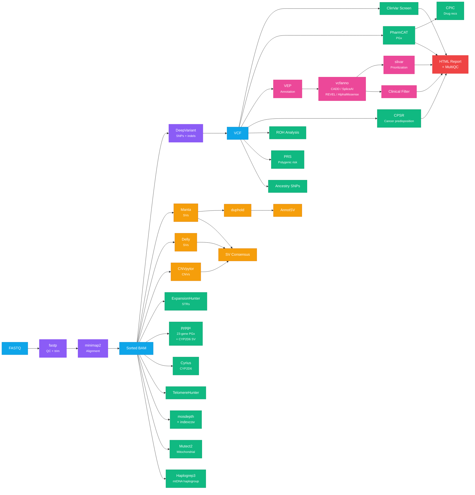

# Pipeline overview

## What You Get

| Category | What It Finds | Steps |
|---|---|---|
| **Variant Calling** | SNPs, indels, structural variants, copy number variants | 3, 4, 4b, 18, 19 |
| **Clinical Screening** | Pathogenic variants, carrier status, cancer predisposition (CPSR panels) | 6, 17 |
| **Pharmacogenomics** | Drug-gene interactions (23+ genes, CYP2C19, CYP2D6 SV, DPYD, etc.) | 7, 21, 27, 32 |
| **Structural Variants** | Deletions, duplications, inversions, translocations (4 callers + consensus) | 4, 4b, 5, 15, 18, 19, 22 |
| **Functional Annotation** | Impact prediction for every variant (VEP + CADD, SpliceAI, REVEL, AlphaMissense) | 13, 30 |
| **Variant Prioritization** | Rare deleterious variants, compound hets, gene constraint filtering | 31 |
| **Repeat Expansions** | Huntington's, Fragile X, ALS, and 50+ other repeat expansion disorders | 9 |
| **Ancestry & Haplogroups** | Mitochondrial haplogroup, consanguinity check, ancestry SNP intersection | 11, 12, 26 |
| **Telomere Length** | Relative telomere content estimation from WGS reads | 10 |
| **Mitochondrial** | Heteroplasmy detection, mitochondrial disease variants | 12, 20 |
| **Polygenic Risk** | Risk scores for 10 common conditions (CAD, T2D, cancers, etc.) | 25 |
| **Quality Control** | Adapter trimming, coverage statistics, aggregated QC report, sex check, SV filtering | 1b, 15, 16, 16b, 28 |

## Pipeline Overview

### All Steps

| # | Step | Tool | Docker Image | Runtime | Required? |
|---|---|---|---|---|---|
| 1 | [ORA to FASTQ](01-ora-to-fastq.md) | orad | `orad` binary | ~30 min | Only for Illumina ORA files |
| 1b | [QC & Trimming](01b-fastp-qc.md) | fastp | `quay.io/biocontainers/fastp:1.3.6` | ~15-30 min | Recommended |
| 2 | [Alignment](02-alignment.md) | minimap2 + samtools | `quay.io/biocontainers/minimap2:2.31` + `staphb/samtools:1.20` | ~1-2 hr | Yes (if starting from FASTQ) |
| 3 | [Variant Calling](03-variant-calling.md) | DeepVariant | `google/deepvariant:1.10.0` | ~2-4 hr | Yes |
| 4 | [Structural Variants](04-structural-variants.md) | Manta | `quay.io/biocontainers/manta:1.6.0` | ~20 min | Recommended |
| 5 | [SV Annotation](05-annotsv.md) | AnnotSV | `quay.io/biocontainers/annotsv:3.5.10` | ~10 min | If step 4 run |
| 6 | [ClinVar Screen](06-clinvar-screen.md) | bcftools isec | `staphb/bcftools:1.21` | ~5 min | Yes |
| 7 | [Pharmacogenomics](07-pharmacogenomics.md) | PharmCAT | `pgkb/pharmcat:3.2.0` | ~10 min | Yes |
| 8 | [HLA Typing](08-hla-typing.md) | T1K | `quay.io/biocontainers/t1k:1.0.9` | ~30 min | Optional |
| 9 | [STR Expansions](09-str-expansions.md) | ExpansionHunter | `quay.io/biocontainers/expansionhunter:5.0.0` | ~15 min | Recommended |
| 9b | [STR Annotation](09b-stranger.md) | Stranger | `quay.io/biocontainers/stranger:0.10.2--pyhdfd78af_0` | ~1 min | If step 9 run |
| 10 | [Telomere Length](10-telomere-analysis.md) | TelomereHunter | `lgalarno/telomerehunter` (digest-pinned) | ~1 hr | Optional |
| 11 | [ROH Analysis](11-roh-analysis.md) | bcftools roh | `staphb/bcftools:1.21` | ~5 min | Recommended |
| 12 | [Mito Haplogroup](12-mito-haplogroup.md) | haplogrep3 | `jtb114/haplogrep3` (digest-pinned) | ~1 min | Optional |
| 13 | [VEP Annotation](13-vep-annotation.md) | VEP | `ensemblorg/ensembl-vep:release_116.0` | ~2-4 hr | Recommended |
| 14 | [Imputation Prep](14-imputation-prep.md) | bcftools | `staphb/bcftools:1.21` | ~10 min | Optional |
| 15 | [SV Quality](15-duphold.md) | duphold | `brentp/duphold:v0.2.3` | ~20 min | If step 4 run |
| 16 | [Coverage QC](16-indexcov.md) | indexcov | `quay.io/biocontainers/goleft:0.2.6` | ~5 sec | Recommended |
| 16b | [Coverage Stats](16b-mosdepth.md) | mosdepth | `quay.io/biocontainers/mosdepth:0.3.14--h05c3d44_0` | ~10 min | Recommended |
| 17 | [Cancer Predisposition](17-cpsr.md) | CPSR | `sigven/pcgr:2.2.5` | ~30-60 min | Recommended |
| 18 | [CNV Calling](18-cnvpytor.md) | CNVpytor | `quay.io/biocontainers/cnvpytor:1.3.2--pyhdfd78af_0` | ~1-3 hr | Optional |
| 19 | [SV Calling (Delly)](19-delly.md) | Delly | `quay.io/biocontainers/delly:2.1.0` | ~2-4 hr | Optional |
| 20 | [Mitochondrial](20-mtoolbox.md) | GATK Mutect2 | `broadinstitute/gatk:4.6.2.0` | ~15-30 min | Optional |

#### Post-Processing Steps

These run after the core pipeline completes and combine outputs from earlier steps.

| # | Step | Tool | Docker Image | Runtime | Required? |
|---|---|---|---|---|---|
| 21 | [CYP2D6 Star Alleles](21-cyrius.md) | Cyrius | `python:3.11-slim` | ~10 min | Experimental |
| 22 | [SV Consensus Merge](22-survivor-merge.md) | bcftools | `staphb/bcftools:1.21` | ~5 min | Experimental |
| 23 | [Clinical Filter](23-clinical-filter.md) | bcftools +split-vep | `staphb/bcftools:1.21` | ~5-10 min | If step 13 run |
| 24 | [HTML Report](24-html-report.md) | bash + bcftools | `staphb/bcftools:1.21` | ~1-3 min | Recommended |
| 25 | [Polygenic Risk Scores](25-prs.md) | plink2 | `pgscatalog/plink2:2.00a5.10` | ~30 min | Exploratory |
| 26 | [Ancestry SNPs](26-ancestry.md) | plink2 | `pgscatalog/plink2:2.00a5.10` | ~30-60 min | Experimental |
| 27 | [CPIC Recommendations](27-cpic-lookup.md) | Python + CPIC | `python:3.11-slim` | ~5 min | If step 7 run |
| 28 | [MultiQC Report](28-multiqc.md) | MultiQC | `quay.io/biocontainers/multiqc:1.35` | ~1 min | Recommended |
| 29 | [Somatic Variants](29-mutect2-somatic.md) | GATK Mutect2 | `broadinstitute/gatk:4.6.2.0` | ~2-6 hr | Experimental |
| 30 | [Annotation Enrichment](30-vcfanno.md) | vcfanno | `quay.io/biocontainers/vcfanno:0.3.9` | ~5-15 min | If step 13 run |
| 31 | [Variant Prioritization](31-slivar.md) | slivar | `quay.io/biocontainers/slivar:0.3.4` | ~5-10 min | If step 13 run |
| 32 | [pypgx Pharmacogenomics](32-pypgx.md) | pypgx | `quay.io/biocontainers/pypgx:0.26.0` | ~20-40 min | Recommended |

**Minimum useful run:** Steps 2, 3, 6, 7 (alignment + variant calling + ClinVar + PharmCAT) = ~4-6 hours.
**Full analysis:** All 34 default steps = ~12-20 hours (step 29 somatic calling is opt-in via `SOMATIC=true`). Steps 4/18/19 and 10/12/20 can run in parallel.

#### Alternative Tools (Benchmarking)

No single variant caller is universally best. The pipeline includes alternative tools that output to separate directories so you can compare results without overwriting the defaults.

| Script | Tool | Alternative To | Output Directory |
|---|---|---|---|
| [02a](https://github.com/GeiserX/Personal-Genome-Pipeline/blob/main/scripts/02a-alignment-bwamem2.sh) | BWA-MEM2 | minimap2 (step 2) | `aligned_bwamem2/` |
| [03a](https://github.com/GeiserX/Personal-Genome-Pipeline/blob/main/scripts/03a-gatk-haplotypecaller.sh) | GATK HaplotypeCaller | DeepVariant (step 3) | `vcf_gatk/` |
| [03b](https://github.com/GeiserX/Personal-Genome-Pipeline/blob/main/scripts/03b-freebayes.sh) | FreeBayes | DeepVariant (step 3) | `vcf_freebayes/` |
| [04a](https://github.com/GeiserX/Personal-Genome-Pipeline/blob/main/scripts/04a-tiddit.sh) | TIDDIT | Manta (step 4) | `sv_tiddit/` |
| [03c](https://github.com/GeiserX/Personal-Genome-Pipeline/blob/main/scripts/03c-strelka2-germline.sh) | Strelka2 | DeepVariant (step 3) | `vcf_strelka2/` |
| [03d](https://github.com/GeiserX/Personal-Genome-Pipeline/blob/main/scripts/03d-octopus.sh) | Octopus | DeepVariant (step 3) | `vcf_octopus/` |
| [04b](https://github.com/GeiserX/Personal-Genome-Pipeline/blob/main/scripts/04b-gridss.sh) | GRIDSS | Manta (step 4) | `sv_gridss/` |
| [benchmark](https://github.com/GeiserX/Personal-Genome-Pipeline/blob/main/scripts/benchmark-variants.sh) | bcftools isec / hap.py | — | `benchmark/` |

See [docs/benchmarking.md](benchmarking.md) for how to run and interpret results, and [docs/tool-rationale.md](tool-rationale.md) for why each default was chosen.

