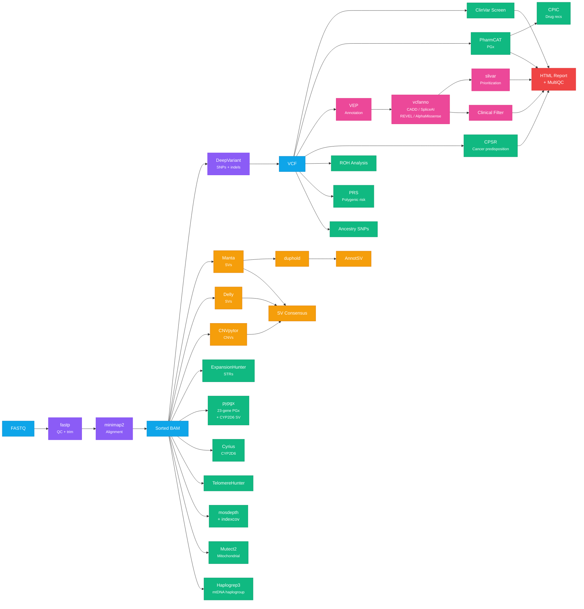

# Pipeline overview

## What You Get

| Category | What It Finds | Steps |
|---|---|---|
| **Variant Calling** | SNPs, indels, structural variants, copy number variants | 3, 4, 4b, 18, 19 |
| **Clinical Screening** | Pathogenic variants, carrier status, cancer predisposition (CPSR panels) | 6, 17 |
| **Pharmacogenomics** | Drug-gene interactions (23+ genes, CYP2C19, CYP2D6 SV, DPYD, etc.) | 7, 21, 27, 32 |
| **Structural Variants** | Deletions, duplications, inversions, translocations (4 callers + consensus) | 4, 4b, 5, 15, 18, 19, 22 |
| **Functional Annotation** | Impact prediction for every variant (VEP + CADD, SpliceAI, REVEL, AlphaMissense) | 13, 30 |
| **Variant Prioritization** | Rare deleterious variants, compound hets, gene constraint filtering | 31 |
| **Repeat Expansions** | Huntington's, Fragile X, ALS and the other disorders at the 31 loci of ExpansionHunter's bundled catalog | 9, 9b |
| **Ancestry & Haplogroups** | Mitochondrial haplogroup, consanguinity check, ancestry SNP intersection | 11, 12, 26 |
| **Telomere Length** | Relative telomere content estimation from WGS reads | 10 |
| **Mitochondrial** | Heteroplasmy detection, mitochondrial disease variants | 12, 20 |
| **Polygenic Risk** | Risk scores for 10 common conditions (CAD, T2D, cancers, etc.) | 25 |
| **Quality Control** | Adapter trimming, coverage statistics, aggregated QC report, sex check, SV filtering | 1b, 15, 16, 16b, 28 |

## Pipeline Overview

### All Steps

| # | Step | Tool | Image variable | Required? |
|---|---|---|---|---|
| 1 | [ORA to FASTQ](01-ora-to-fastq.md) | orad | `orad` binary | Only for Illumina ORA files |
| 1b | [QC & Trimming](01b-fastp-qc.md) | fastp | `FASTP_IMAGE` | Recommended |
| 2 | [Alignment](02-alignment.md) | minimap2 + samtools | `MINIMAP2_IMAGE` + `SAMTOOLS_IMAGE` | Yes (if starting from FASTQ) |
| 3 | [Variant Calling](03-variant-calling.md) | DeepVariant | `DEEPVARIANT_IMAGE` | Yes |
| 4 | [Structural Variants](04-structural-variants.md) | Manta | `MANTA_IMAGE` | Recommended |
| 5 | [SV Annotation](05-annotsv.md) | AnnotSV | `ANNOTSV_IMAGE` | If step 4 run |
| 6 | [ClinVar Screen](06-clinvar-screen.md) | bcftools isec | `BCFTOOLS_IMAGE` | Yes |
| 7 | [Pharmacogenomics](07-pharmacogenomics.md) | PharmCAT | `PHARMCAT_IMAGE` | Yes |
| 8 | [HLA Typing](08-hla-typing.md) | T1K | `T1K_IMAGE` | Optional |
| 9 | [STR Expansions](09-str-expansions.md) | ExpansionHunter | `EXPANSIONHUNTER_IMAGE` | Recommended |
| 9b | [STR Annotation](09b-stranger.md) | Stranger | `STRANGER_IMAGE` | If step 9 run |
| 10 | [Telomere Length](10-telomere-analysis.md) | TelomereHunter | `TELOMEREHUNTER_IMAGE` | Optional |
| 11 | [ROH Analysis](11-roh-analysis.md) | bcftools roh | `BCFTOOLS_IMAGE` | Recommended |
| 12 | [Mito Haplogroup](12-mito-haplogroup.md) | haplogrep3 | `HAPLOGREP3_IMAGE` | Optional |
| 13 | [VEP Annotation](13-vep-annotation.md) | VEP | `VEP_IMAGE` | Recommended |
| 14 | [Imputation Prep](14-imputation-prep.md) | bcftools | `BCFTOOLS_IMAGE` | Optional, opt-in (`IMPUTATION=true`) |
| 15 | [SV Quality](15-duphold.md) | duphold | `DUPHOLD_IMAGE` | If step 4 run |
| 16 | [Coverage QC](16-indexcov.md) | indexcov | `GOLEFT_IMAGE` | Recommended |
| 16b | [Coverage Stats](16b-mosdepth.md) | mosdepth | `MOSDEPTH_IMAGE` | Recommended |
| 17 | [Cancer Predisposition](17-cpsr.md) | CPSR | `PCGR_IMAGE` | Recommended |
| 18 | [CNV Calling](18-cnvpytor.md) | CNVpytor | `CNVPYTOR_IMAGE` | Optional |
| 19 | [SV Calling (Delly)](19-delly.md) | Delly | `DELLY_IMAGE` | Optional |
| 20 | [Mitochondrial](20-mtoolbox.md) | GATK Mutect2 | `GATK_IMAGE` | Optional |

#### Post-Processing Steps

These run after the core pipeline completes and combine outputs from earlier steps.

| # | Step | Tool | Image variable | Required? |
|---|---|---|---|---|
| 21 | [CYP2D6 Star Alleles](21-cyrius.md) | Cyrius | `PYTHON_IMAGE` | Experimental |
| 22 | [SV Consensus Merge](22-survivor-merge.md) | bcftools | `BCFTOOLS_IMAGE` | Experimental |
| 23 | [Clinical Filter](23-clinical-filter.md) | bcftools +split-vep | `BCFTOOLS_IMAGE` | If step 13 run |
| 24 | [HTML Report](24-html-report.md) | bash + bcftools | `BCFTOOLS_IMAGE` | Recommended |
| 25 | [Polygenic Risk Scores](25-prs.md) | plink2 | `PLINK2_IMAGE` | Exploratory |
| 26 | [Ancestry SNPs](26-ancestry.md) | plink2 | `PLINK2_IMAGE` | Experimental, opt-in (`ANCESTRY=true`) |
| 27 | [CPIC Recommendations](27-cpic-lookup.md) | Python + CPIC | `PYTHON_IMAGE` | If step 7 run |
| 28 | [MultiQC Report](28-multiqc.md) | MultiQC | `MULTIQC_IMAGE` | Recommended |
| 29 | [Somatic Variants](29-mutect2-somatic.md) | GATK Mutect2 | `GATK_IMAGE` | Experimental, opt-in (`SOMATIC=true`) |
| 30 | [Annotation Enrichment](30-vcfanno.md) | vcfanno | `VCFANNO_IMAGE` | If step 13 run |
| 31 | [Variant Prioritization](31-slivar.md) | slivar | `SLIVAR_IMAGE` | If step 13 run |
| 32 | [pypgx Pharmacogenomics](32-pypgx.md) | pypgx | `PYPGX_IMAGE` | Recommended |

### What a default run covers

A default `./scripts/run-all.sh <sample> <sex>` runs **31 numbered steps**: 1b and 2 (only when there is no BAM yet), 3 (only when there is no VCF yet), 4, 5, 6, 7, 8, 9, 9b, 10, 11, 12, 13, 15, 16, 16b, 17, 18, 19, 20, 21, 22, 23, 24, 25, 27, 28, 30, 31 and 32. Steps 5, 13, 17, 18 and 32 are reported as skipped when their data is not installed, and 23, 30 and 31 when step 13 did not run. It ends with the summary report (`generate-report.sh`).

Off unless you ask for them: 4b (`GRIDSS=true`), 14 (`IMPUTATION=true`), 26 (`ANCESTRY=true`), 29 (`SOMATIC=true`), the alternative callers 3a to 3d (`EXTRA_CALLERS=gatk,freebayes,strelka2,octopus`) and the caller comparison (`BENCHMARK=true`). Step 1 (ORA input) and the other alternative scripts (2a, 2b, 3e, 4a, 4c) run only by hand.

The minimum useful run is steps 2, 3, 6 and 7 (alignment, variant calling, ClinVar, PharmCAT). Runtimes per step and for a whole run are on [Hardware and storage requirements](hardware-requirements.md#runtime-per-step).

#### Alternative Tools (Benchmarking)

No single variant caller is universally best. The pipeline includes alternative tools that output to separate directories so you can compare results without overwriting the defaults.

| Script | Tool | Alternative To | Output Directory |
|---|---|---|---|
| [02a](https://github.com/GeiserX/Personal-Genome-Pipeline/blob/main/scripts/02a-alignment-bwamem2.sh) | BWA-MEM2 | minimap2 (step 2) | `aligned_bwamem2/` |
| [03a](https://github.com/GeiserX/Personal-Genome-Pipeline/blob/main/scripts/03a-gatk-haplotypecaller.sh) | GATK HaplotypeCaller | DeepVariant (step 3) | `vcf_gatk/` |
| [03b](https://github.com/GeiserX/Personal-Genome-Pipeline/blob/main/scripts/03b-freebayes.sh) | FreeBayes | DeepVariant (step 3) | `vcf_freebayes/` |
| [04a](https://github.com/GeiserX/Personal-Genome-Pipeline/blob/main/scripts/04a-tiddit.sh) | TIDDIT | Manta (step 4) | `sv_tiddit/` |
| [03c](https://github.com/GeiserX/Personal-Genome-Pipeline/blob/main/scripts/03c-strelka2-germline.sh) | Strelka2 | DeepVariant (step 3) | `vcf_strelka2/` |
| [03d](https://github.com/GeiserX/Personal-Genome-Pipeline/blob/main/scripts/03d-octopus.sh) | Octopus | DeepVariant (step 3) | `vcf_octopus/` |
| [04b](https://github.com/GeiserX/Personal-Genome-Pipeline/blob/main/scripts/04b-gridss.sh) | GRIDSS | Manta (step 4) | `sv_gridss/` |
| [benchmark](https://github.com/GeiserX/Personal-Genome-Pipeline/blob/main/scripts/benchmark-variants.sh) | bcftools isec / hap.py | — | `benchmark/` |

See [docs/benchmarking.md](benchmarking.md) for how to run and interpret results, and [docs/tool-rationale.md](tool-rationale.md) for why each default was chosen.

